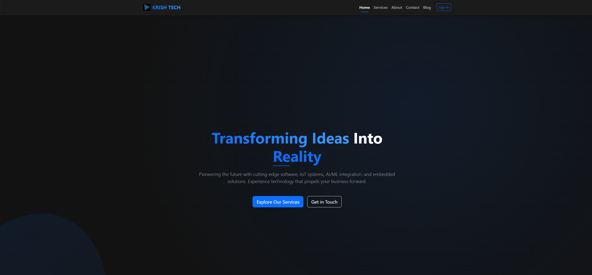

# KRISH TECH - Dark Mode Website

## Overview
KRISH TECH website is a sleek, modern, dark-themed corporate website designed for a technology company specializing in software development, IoT systems, AI/ML, and embedded solutions. The website features a responsive design with iOS-smooth animations, glass-morphism effects, and Bootstrap 5 integration.



## Live Demo
[View Demo](#) (Replace with actual demo link when deployed)

## Features
- **Dark Mode Design**: Deep grays with glass morphism effects throughout for reduced eye strain
- **iOS-Smooth Transitions**: Sub-200ms animations for a native-app feel
- **Responsive Layout**: Fully responsive design that works on all device sizes
- **Bootstrap 5 Integration**: Built with Bootstrap 5 utility classes and components
- **Multiple Page Templates**: 8 fully designed page templates (Login, Home, Services, Contact, About, Blog, Portfolio, FAQ)
- **Interactive Components**: 
  - Form validation with animated feedback
  - Filtering systems for Portfolio, Blog, and FAQ
  - Image galleries with smooth transitions
  - Timeline animations
  - Animated counters
  - Interactive modals
  - Live chat widget prototype
- **Accessibility Features**: High contrast text, semantic HTML, and proper ARIA attributes

## Pages
1. **Login Page**: Authentication page with floating labels and password toggle
2. **Home Page**: Features hero section, service cards, featured project, and testimonials
3. **Services Page**: Detailed service listings with sticky navigation and modal details
4. **Contact Page**: Contact form with validation and interactive map integration
5. **About Page**: Company information, animated timeline, team cards with hover effects
6. **Blog Page**: Article grid with category filtering and featured post spotlight
7. **Portfolio Page**: Project showcase with grid/list view toggle and detailed project modals
8. **FAQ Page**: Categorized questions with search functionality and smooth scrolling

## File Structure
```
krish-tech/
├── index.html             # Home page
├── login.html             # Login page
├── services.html          # Services page
├── contact.html           # Contact page
├── about.html             # About page
├── blog.html              # Blog page
├── portfolio.html         # Portfolio page
├── faq.html               # FAQ page
├── css/
│   └── styles.css         # Main stylesheet
├── js/
│   ├── main.js            # Shared functionality
│   ├── login.js           # Login page functionality
│   ├── contact.js         # Contact page functionality
│   ├── services.js        # Services page functionality
│   ├── blog.js            # Blog page functionality
│   ├── portfolio.js       # Portfolio page functionality
│   ├── about.js           # About page functionality
│   └── faq.js             # FAQ page functionality
└── img/
    ├── krish-tech-logo.svg # Company logo
    └── ... (other images)
```

## Installation & Usage

### Local Installation
1. Clone the repository or download the ZIP file:
   ```
   git clone https://github.com/your-username/krish-tech.git
   ```

2. Navigate to the project directory:
   ```
   cd krish-tech
   ```

3. Open any HTML file in your browser to view the page:
   ```
   open index.html
   ```

### Development Setup
For active development with auto-reload:

1. Install a local development server like [Live Server](https://marketplace.visualstudio.com/items?itemName=ritwickdey.LiveServer) for VS Code

2. Or use Python's built-in HTTP server:
   ```
   python -m http.server
   ```

3. Visit `http://localhost:8000` in your browser

### Deployment
To deploy the website to a live server:

1. Upload all files to your web hosting via FTP or your hosting's control panel
2. Ensure the file structure is maintained
3. For GitHub Pages deployment:
   - Push the repository to GitHub
   - Enable GitHub Pages in repository settings
   - Set the source branch to `main` and folder to `/ (root)`

## Customization

### Changing Colors
The primary colors are defined as CSS variables in `styles.css`:

```css
:root {
  /* Dark Mode Colors */
  --dark-base: #121212;
  --dark-surface: #1E1E1E;
  --dark-elevated: #2a2a2a;
  --dark-glass: rgba(30, 30, 30, 0.75);
  
  /* Brand Colors */
  --primary: #0d6efd;
  --primary-dark: #0a58ca;
  --primary-light: #409cff;
  --success: #198754;
  --info: #0dcaf0;
  --warning: #ffc107;
  --danger: #dc3545;
}
```

Modify these values to change the color scheme throughout the website.

### Replacing Images
1. Replace the logo at `img/krish-tech-logo.svg` with your own logo
2. Replace other images in the `img/` directory with your own content
3. Ensure new images maintain the same naming convention for proper loading

### Modifying Content
Edit the HTML files to update text content, services information, team members, etc.

## Browser Compatibility
- Chrome 90+
- Firefox 88+
- Safari 14+
- Edge 90+
- Opera 76+
- iOS Safari 14+
- Android Chrome 90+

## Technologies Used
- HTML5
- CSS3 (with custom properties/variables)
- JavaScript (ES6+)
- Bootstrap 5
- Font Awesome 6

## Performance Optimization
- Smooth animations with GPU acceleration
- Optimized image loading
- Minimal external dependencies
- Efficient CSS selectors
- Event delegation for improved interaction handling

## Credits
- Bootstrap: [https://getbootstrap.com/](https://getbootstrap.com/)
- Font Awesome: [https://fontawesome.com/](https://fontawesome.com/)
- Google Fonts (optional)

## License
This project is available for personal and commercial use.

## Contact
For questions or customization requests, please contact:
- Email: your-email@example.com
- Website: [yourwebsite.com](https://yourwebsite.com)

---

## Project Description (for GitHub/Portfolio)

**KRISH TECH** is a comprehensive dark-mode corporate website for a technology company, featuring modern design elements, interactive components, and smooth animations. 

This project showcases advanced front-end development skills including:

- Implementation of a cohesive dark theme with glass-morphism effects
- Creation of iOS-smooth animations and transitions for enhanced UX
- Responsive design principles ensuring perfect display across all devices
- Interactive form validation with animated feedback
- Dynamic content filtering and search functionality
- Bootstrap 5 integration with custom styling
- Pure JavaScript solutions without reliance on jQuery
- Modular JavaScript organization for maintainable code

The website includes 8 fully-functional pages (Home, Login, Services, Contact, About, Blog, Portfolio, and FAQ) with consistent styling and interactive features throughout. Each page demonstrates attention to detail in both design and functionality, creating an engaging user experience that maintains the brand's high-tech identity.

Perfect for technology companies, startups, or digital agencies looking for a modern web presence with a dark theme that reduces eye strain while conveying technical sophistication.
